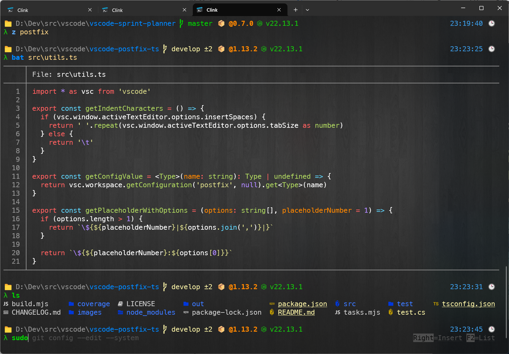
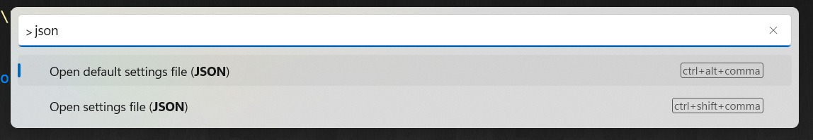

# Windows Terminal setup

This is a "backup" of my current WT settings. Feel free to use it but YMMV and I cannot guarantee everything will work flawlessly.

# Features

- [Clink](https://github.com/chrisant996/clink) with all its glory
- [Clink completions](https://github.com/chrisant996/clink-completions) for git, npm, etc.
- [Clink flex prompt](https://github.com/chrisant996/clink-flex-prompt) + font for glyphs
- Integration with [fzf](https://github.com/chrisant996/clink-fzf)
- [aliases](aliases)
- [gsudo](https://github.com/gerardog/gsudo) - `sudo` for Windows, eg. `sudo choco install ...`
- some additional utilities bundled:
  - [ab.exe](https://en.wikipedia.org/wiki/ApacheBench)
  - [bat.exe](https://github.com/sharkdp/bat) - `cat` with syntax highlighting
  - curl.exe
  - [datamash.exe](https://www.gnu.org/software/datamash/)
  - [jq.exe](https://stedolan.github.io/jq/tutorial/) (query json from cmd)
  - cloc.exe to measure lines of code in project
  - TimeMem.exe (UNIX `time` alternative)
  - [xml.exe](http://xmlstar.sourceforge.net/doc/UG/ch04.html) (query xml from cmd)
  - \+ few others (see [bin](bin))



# Installation

1. Install Clink from this repo (set CLINK_DIR env to your directory)
2. Install all fonts from `fonts` folder and use it in Windows Terminal
3. Install required dependencies using the script (or manually if you don't use `choco`):
```shell
$ choco install fzf gsudo ripgrep
```
4. Setup Windows Terminal task: 

You can open your settings file by opening Command Palette (**Ctrl-Shift-P** by default), typing `json` and selecting `Open settings file (JSON)` (**Ctrl-Shift-,** by default)



Put the following into `profiles.list[]` section:
```json
{
    "bellStyle": "taskbar",
    "commandline": "%SystemRoot%\\System32\\cmd.exe /s /k \"%CLINK_DIR%\\clink_x64.exe inject --profile %CLINK_DIR%\\profile\"",
    "elevate": false,
    "guid": "{6d765724-f16b-47d1-9e76-60051d01d354}",
    "hidden": false,
    "icon": "%CLINK_DIR%\\clink.ico",
    "name": "Clink",
    "startingDirectory": "%USERPROFILE%"
}
```

# Extras

