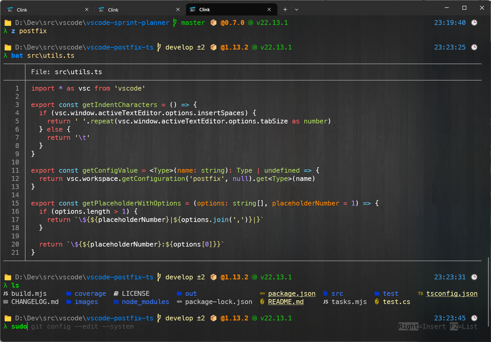
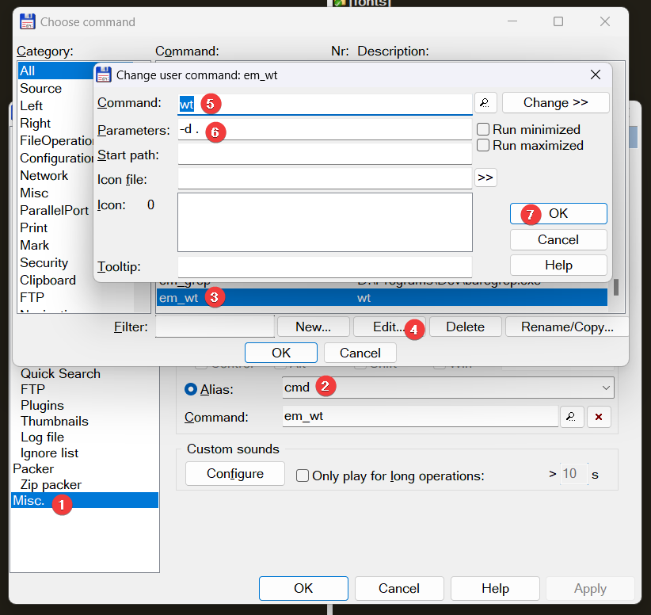

# Windows Terminal setup

This is a "backup" of my current WT settings. Feel free to use it but YMMV and I cannot guarantee everything will work flawlessly.

# Features

- [Clink](https://github.com/chrisant996/clink) with all its glory
- [Clink completions](https://github.com/chrisant996/clink-completions) for git, npm, etc.
- [Starship prompt](https://starship.rs)
- [Clink Gizmos](https://github.com/chrisant996/clink-gizmos)
- Integration with [fzf](https://github.com/junegunn/fzf) - part of clink-gizmos
- Integration with [zoxide](https://github.com/ajeetdsouza/zoxide) - smart directory jumping
- [aliases](aliases)
- some additional utilities bundled:
  - [bat.exe](https://github.com/sharkdp/bat) - `cat` with syntax highlighting
  - curl.exe
  - TimeMem.exe (UNIX `time` alternative)
  - \+ few others (see [bin](bin))



# Installation

1. Install Clink from this repo (set CLINK_DIR env to your directory)
2. Install all fonts from `fonts` folder and use it in Windows Terminal
3. Install required dependencies using the script (or manually if you don't use `choco`):
```shell
$ choco install fzf fd eza ripgrep jq zoxide
```
4. Run the following command in Clink directory to set it up:
```shell
$ clink autorun install -- --profile <PATH_TO_CLINK>\profile
```

This will set up Clink to run with the provided profile on every cmd.exe session. If you want to have it only in WT, you can skip this step and configure WT to run cmd.exe with Clink profile (`cmd.exe /s /k "%CLINK_DIR%\clink_x64.exe inject --profile %CLINK_DIR%\profile"`).

In order to get rid of standard cmd.exe welcome message change settings in WT (and other apps if needed) to run cmd.exe with `/K` like this:
```shell
cmd.exe /k
```

# Extras

## Total Commander

I'm a fan of this so why not make them coexist?

First of all configure an alias so that you can run a WT session by typing in `cmd`:

This way it will run a WT session inside your current directory (from active pane).

It can also work the other way around. There is an alias defined in [aliases](aliases) file so when you run `tc.` inside Windows Terminal it should open current directory in Total Commander.
Adjust the alias to your liking (left or right pane, etc.).

Bear in mind this relies on **%COMMANDER_EXE%** envinronment variable. This is automatically provided by Total Commander process when you start your WT process from inside TC. Otherwise you can adjust the alias to use fixed path or set this env var globally for your user in the system.
