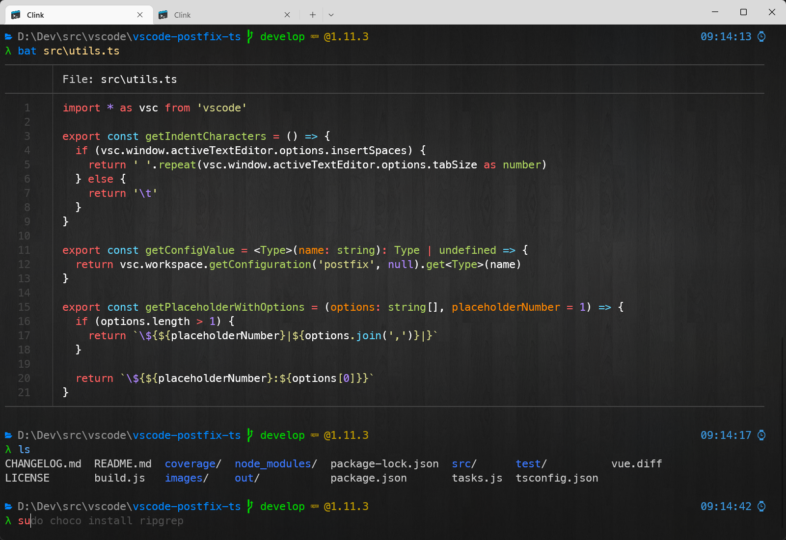
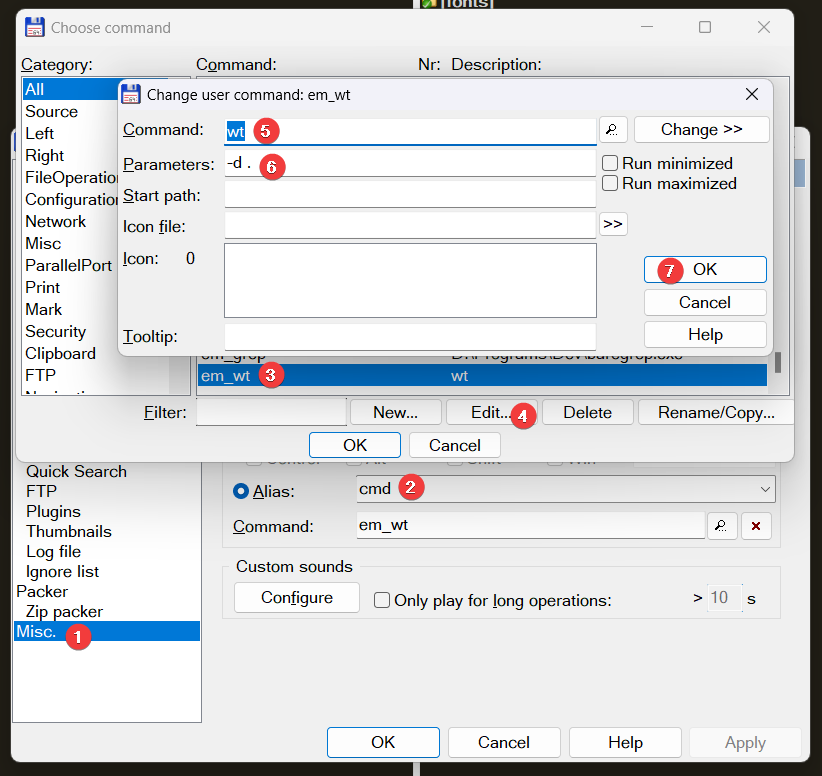

# Windows Terminal setup

This is a "backup" of my current WT settings. Feel free to use it but YMMV and I cannot guarantee everything will work flawlessly.

# Features

- [Clink](https://github.com/chrisant996/clink) with all its glory
- [Clink completions](https://github.com/chrisant996/clink-completions) for git, npm, etc.
- [Clink flex prompt](https://github.com/chrisant996/clink-flex-prompt) + font for glyphs
- Integration with [fzf](https://github.com/chrisant996/clink-fzf)
- [aliases](aliases)
- [gsudo](https://github.com/gerardog/gsudo) - `sudo` for Windows, eg. `sudo choco install ...`
- some additional utilities bundled:
  - [bat.exe](https://github.com/sharkdp/bat) - `cat` with syntax highlighting
  - curl.exe
  - [jq.exe](https://stedolan.github.io/jq/tutorial/) (query json from cmd)
  - cloc.exe to measure lines of code in project
  - TimeMem.exe (UNIX `time` alternative)
  - [xml.exe](http://xmlstar.sourceforge.net/doc/UG/ch04.html) (query xml from cmd)
  - \+ few others (see [bin](bin))



# Installation

1. Install Clink from this repo (set CLINK_DIR env to your directory)
2. Install all fonts from `fonts` folder and use it in Windows Terminal
3. Install required dependencies using the script (or manually if you don't use `choco`):
```shell
$ choco install fzf gsudo ripgrep
```
4. Setup Windows Terminal task: 

You can open your settings file by opening Command Palette (**Ctrl-Shift-P** by default), typing `json` and selecting `Open settings file (JSON)` (**Ctrl-Shift-,** by default)


Put the following into `profiles.list[]` section:
```json
{
    "bellStyle": "taskbar",
    "commandline": "%SystemRoot%\\System32\\cmd.exe /s /k \"%CLINK_DIR%\\clink_x64.exe inject --profile %CLINK_DIR%\\profile\"",
    "elevate": false,
    "guid": "{6d765724-f16b-47d1-9e76-60051d01d354}",
    "hidden": false,
    "icon": "%CLINK_DIR%\\clink.ico",
    "name": "Clink",
    "startingDirectory": "%USERPROFILE%"
}
```

5. Set as default profile if you like it

# Extras

## Docker

If you're a docker user I strongly recommend trying [lazydocker](https://github.com/jesseduffield/lazydocker) and `dive` when building your own images (bundled inside `bin` in this repo so available from anywhere)

## Total Commander

I'm a fan of this so why not make them coexist?

First of all configure an alias so that you can run a WT session by typing in `cmd`:

This way it will run a WT session inside your current directory (from active pane).

It can also work the other way around. There is an alias defined in [aliases](aliases) file so when you run `tc.` inside Windows Terminal it should open current directory in Total Commander.
Adjust the alias to your liking (left or right pane, etc.).

Bear in mind this relies on **%COMMANDER_EXE%** envinronment variable. This is automatically provided by Total Commander process when you start your WT process from inside TC. Otherwise you can adjust the alias to use fixed path or set this env var globally for your user in the system.